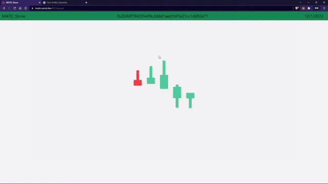

# 🎴 $MATIC Stone — NFT Trading Card Game on the Blockchain

Cryptocurrencies are booming 🚀, with new tokens launching every hour! Amid this growth, **decentralized storage** is opening new doors — and $MATIC Stone is here to combine that with an exciting **JavaScript trading card game** where every card is a unique mintable NFT.

---

### How it works 🛠️

When you first visit the site, you can **mint a full deck of unique trading cards** — each one an NFT that you truly own and can trade on the blockchain. These cards store their metadata and AI-generated artwork securely and decentralized on the Ethereum mainnet and testnet.

  

On future visits, simply connect your **MetaMask** wallet 🔐 and your first 30 MaticStone tokens will load, initializing your unique deck and custom gameplay experience — think **Magic: The Gathering**, but on the blockchain!

  

---

### Play, Trade, Own 💥

Just like physical trading card games, you’re free to **trade your cards** on popular NFT marketplaces like **OpenSea** or **Rarible**. The minting, distribution, and token lifecycle is fully managed by Solidity smart contracts running on the blockchain — no centralized servers involved!

  

---

### Technology Stack 💻

- **ERC721 NFTs** for unique token ownership  
- **IPFS** (Interplanetary File System) to store card images and metadata decentralized  
- **Solidity smart contracts** deployed on Ethereum mainnet & testnet  
- Frontend built with **ReactJS** + **Bootstrap CSS** for smooth UI & state management  
- Wallet integration with **MetaMask** for seamless Web3 connectivity

---

### Why $MATIC Stone? 🌟

- Decentralized ownership means **you truly own your cards**  
- AI-generated artwork makes each card **one of a kind**  
- Trade anywhere, anytime on the blockchain’s open marketplaces  
- Enjoy a classic trading card game experience with a modern blockchain twist!

---

Ready to start your collection and battle? Connect your wallet and jump in! 🎮✨  
